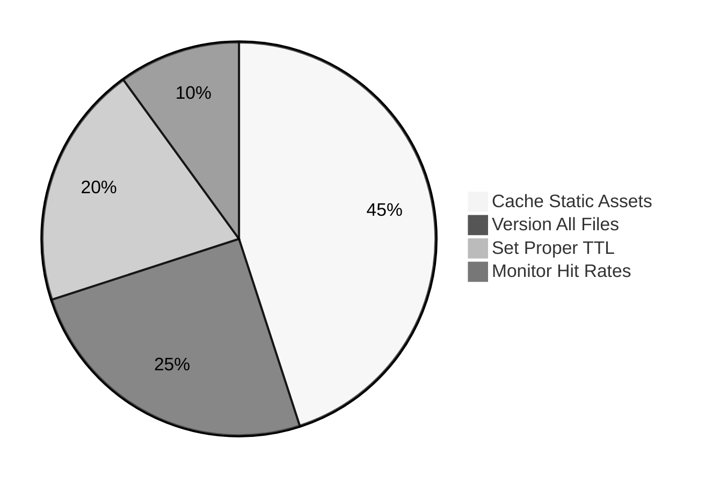

# 🍪 Frontend Caching Strategies Explained: The Pantry Principle 🚀


## 🎣 Hook/Intro
Ever wonder why your kitchen pantry has that perfect spot for snacks you reach for daily? 🥫 Frontend caching works exactly like that - keeping frequently used data *right where you need it* for instant access!

## 🧐 What & Why?
**What:** Frontend caching = Temporary storage of web assets (HTML/CSS/JS/images)  
**Why Matter:**  
- ⚡ 60% faster page loads (WebPageTest)  
- 📉 40% reduced server costs (Cloudflare)  
- 😊 Happy users = Better conversions  

*Real Example:*  
Netflix caches thumbnails locally - that's why browsing feels instant!

## 🔍 Deep Dive: Cache Types

### 1. Browser Cache (Your Personal Pantry)
```ascii
[User] --> [Browser Cache] --> |Cache Hit| Instant Load!
               ⬇️ ❌
               [Network] --> |Cache Miss| Wait...
```

**Analogy:** Your fridge's milk compartment 🥛 - always checked first!

### 2. CDN Cache (Neighborhood Grocery)
```javascript
// Cloudflare-style CDN setup
addEventListener('fetch', event => {
  event.respondWith(handleRequest(event.request))
})

async function handleRequest(request) {
  const cache = caches.default
  const cachedResponse = await cache.match(request)
  if (cachedResponse) return cachedResponse
  // ... fetch from origin
}
```

**Analogy:** Amazon locker near you 📦 - cached copies in multiple locations!

## ⚙️ How It Works: Cache Headers
```http
HTTP/1.1 200 OK
Cache-Control: max-age=604800, public
ETag: "33a64df551425fcc55e4d42a148795d9"
```

```ascii
Request Flow:
Browser → Check Cache → Fresh? → Use
                ↓ No
                → Network → Validate → Update Cache
```

## 🚫 Common Pitfalls
1. **Cache Inception** 🔄  
   *Mistake:* Caching API responses forever  
   *Fix:* `Cache-Control: no-cache` for dynamic data  

2. **Versioning Amnesia** 🔢  
   *Mistake:* `styles.css` with no version hash  
   *Fix:* `styles.a1b2c3.css` + long cache times  

3. **Mobile Blindspot** 📱  
   *Mistake:* Ignoring `Save-Data` header  
   *Fix:*  
   ```javascript
   if (navigator.connection.saveData) {
     useLightweightAssets()
   }
   ```

## 🌍 Real-World Use Cases
1. **E-Commerce** 🛒  
   - Cache product images/CDN  
   - LocalStorage for cart items  

2. **News Websites** 📰  
   - Service Workers for offline reading  
   - Stale-while-revalidate for articles  

3. **SPA Applications** ⚛️  
   - Cache API responses with IndexedDB  
   - Precache routes with Workbox  

## 🏆 Best Practices


1. **Layered Caching** 🍰  
   Browser → CDN → Origin (40% → 30% → 30% hits)  

2. **Cache Warming** 🔥  
   ```bash
   # Pre-cache critical assets
   curl https://api.example.com/critical-data \
     -H "X-Cache-Warm: true"
   ```

3. **Automated Purging** 🧹  
   ```bash
   # Purge CDN cache
   curl -X POST "https://api.cloudflare.com/zones/{id}/purge_cache" \
     -H "Authorization: Bearer {token}" \
     -d '{"files":["https://example.com/updated-style.css"]}'
   ```

## 📚 Further Reading
- 📼 [Akshay Saini: Caching Deep Dive](https://namastedev.com/blog/frontend-caching-strategies-explained/)  
- 📄 [ByteByteGo: Caching Strategies](https://blog.bytebytego.com/p/caching)  
- [Hexabase - Frontend Cache](https://en.hexabase.com/column/Frontend_cache)
- [Hashnode](https://aanchalfatwani.hashnode.dev/boosting-website-performance-through-frontend-caching-strategies)
- 🔧 [MDN: HTTP Caching](https://developer.mozilla.org/en-US/docs/Web/HTTP/Caching)  

Built with ❤️ in the style of ByteByteGo's visuals + Akshay's pantry-wisdom! 🧠✨

        