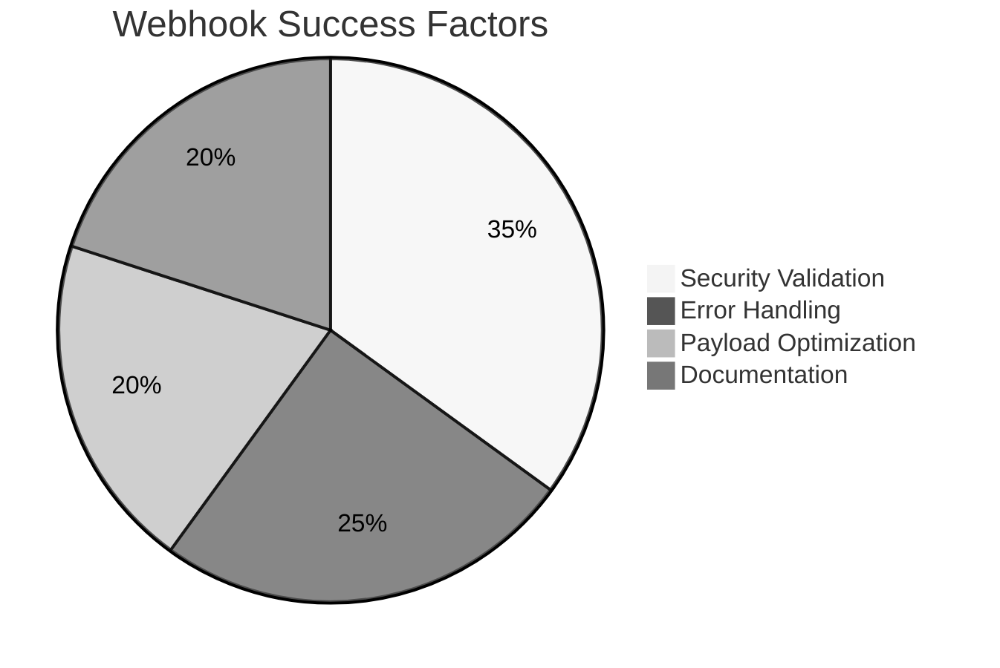

# 🤖 Webhooks Explained: The Pizza Delivery of the Internet 🍕
## 🔍 Deep Dive: Webhook Workflow
```ascii
[Event Source]       [Your Server]
     |                    |
     | 1. Subscribe       |
     |------------------->|
     |                    |
     | 2. Event Occurred  |
     |------------------->|
     |    HTTP POST       |
     |    {event_data}    |
     |                    |
     | 3. Process & Reply |
     |<-------------------|
     |    200 OK          |
     |                    |
     | 4. Retry Mechanism |
     |⇠⇢⇠⇢⇠⇢⇠⇢⇠⇢⇠⇢⇠⇢⇠⇠⇠⇠|
     (Exponential Backoff)
```

**Visual Analogy:**  
📱 Your Phone: Webhook endpoint URL  
📨 Text Message: HTTP POST payload  
🔄 Read Receipt: 200 OK response  
⏰ "Resend if unread": Retry mechanism

        

## 🎣 Hook/Intro
Imagine ordering pizza 🍕 - would you rather:
1. Call every 5 minutes asking "Is it ready?" 🔄 (Polling)
2. Get a text when it's out for delivery? 📲 (Webhooks)

Webhooks are the pizza notification system of the internet!

## 🧐 What & Why?
**What:** Webhooks = User-defined HTTP callbacks triggered by events  
**Why Matter:**  
- ⚡ Real-time updates without constant polling  
- 🔋 70% less server resources used (Cloudflare)  
- 🤖 Perfect for event-driven architectures  

*Real Example:*  
Stripe uses webhooks to notify you about payments - no more manual checking!

## 🔍 Deep Dive: Webhook Workflow
```ascii
[Your Server] <-- Wait --> [Event occurs] --> [3rd Party Server]
     ↑                          |                   ↓
     |-- HTTP POST with data ----|              [Webhook Trigger]
```

**Analogy:** Your phone number = Webhook URL 📞  
"Text me when X happens" = Webhook subscription  

## ⚙️ How It Works: Under the Hood
```javascript
// Express.js Webhook Listener
app.post('/stripe-webhook', async (req, res) => {
  const sig = req.headers['stripe-signature'];
  const event = stripe.webhooks.constructEvent(req.body, sig, secret);
  
  switch(event.type) {
    case 'payment.succeeded':
      await handleSuccessfulPayment(event.data);
      break;
    // ... other events
  }
  res.status(200).end();
});
```

```ascii
Webhook Sequence:
1. Register URL → "Notify me at https://my.app/webhooks"
2. Event occurs → HTTP POST to URL
3. Process event → Send response (200 OK)
4. Retry if failed → Exponential backoff 🔄
```

## 🚫 Common Pitfalls
1. **No Signature Verification** 🔓  
   *Mistake:* Trusting all incoming requests  
   *Fix:* Always verify HMAC signatures  

2. **State Management Amnesia** 🤯  
   *Mistake:* Not making webhooks idempotent  
   *Fix:* Use event IDs + deduplication  

3. **Timeout Troubles** ⏳  
   *Mistake:* Long processing in handler  
   *Fix:* Queue events immediately, process later  

## 🌍 Real-World Use Cases
1. **Payment Processors** 💳  
   - Stripe: Payment success/failure alerts  
   - PayPal: Dispute resolution updates  

2. **CI/CD Pipelines** 🚀  
   - GitHub: Code push notifications  
   - GitLab: Merge request updates  

3. **IoT Systems** 🔌  
   - Smart thermostat alerts  
   - Security camera motion detection  

## 🏆 Best Practices


1. **Security First** 🔐  
   ```javascript
   // Verify HMAC signature
   const signature = crypto
     .createHmac('sha256', secret)
     .update(rawBody)
     .digest('hex');
   ```

2. **Retry Strategy** 🔄  
   ```bash
   # Exponential backoff pattern
   1st failure: Retry after 10s
   2nd failure: Retry after 30s
   3rd failure: Retry after 90s
   ```

3. **Payload Optimization** 🚚  
   ```json
   {
     "event_id": "evt_123",
     "type": "payment.succeeded",
     "data": {
       "amount": 1999,
       "currency": "usd"
     },
     "created": 1629999999
   }
   ```

## 📚 Further Reading
- 📼 [Akshay Saini: Webhooks vs APIs - Real World Examples](https://www.youtube.com/watch?v=OaGqxosUQR4)  
- 📄 [ByteByteGo: Webhooks in System Design](https://blog.bytebytego.com/p/ep65-webhooks-in-system-design)  
- 🔧 [Stripe Webhook Guide](https://stripe.com/docs/webhooks)  
- 📘 [GitHub Webhooks Documentation](https://docs.github.com/en/webhooks)  
- 🧪 [Webhooks.fyi - Interactive Guide](https://webhooks.fyi)  

Built with ❤️ combining ByteByteGo's architectural clarity with Akshay's kitchen analogies! 🧑🍳✨

        